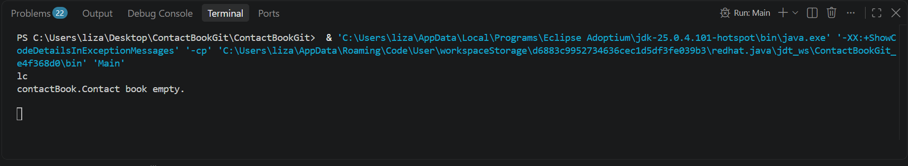

# ContactBookGit

**Software Engineering class of 2026/27 - Homework Lab. 1**

## Group Members

| Nome | Número de aluno |
|------|------------------|
| Bernardo Romão | 67709 |
| Elsa Coimbra | 67915 |
| Inês Isabel Silva | 70929 |


## Application Information

**ContactBook** is a contact book application. It stores contact information such as name, email and phone number, and lets the user perform actions like creating, deleting and comparing contacts.


## Task Summary

The base implementation was provided by the teaching team, and our group completed the two missing commands:

- **GN** - search for a contact given its phone number
- **EP** - check whether there are contacts sharing the same phone number

In addition, we added Javadoc comments to every method in the provided classes (`Contact`, `ContactBook` and `Main`), documenting each method's purpose, parameters, return values and preconditions.


## Command Details

### GN - Search Contact by Phone Number

The command is handled by `searchContactByNumber()` in `Main.java`, which reads a phone number from standard input and calls `ContactBook.getOlderContactNameByPhone()` to search for a matching contact.

`ContactBook.getOlderContactNameByPhone()` works as follows:
1. It calls the private helper method `searchIndex(int phone)` to locate the first contact with the specified phone number.
2. `searchIndex(int phone)` performs a linear search from index `0` up to `counter - 1`. Since contacts are stored in insertion order, the first match found naturally corresponds to the oldest contact with that number.
3. If a contact is found, its index is returned and `getOlderContactNameByPhone()` returns the contact's name.
4. If no contact matches the given phone number, `searchIndex` returns `-1`, and `getOlderContactNameByPhone()` returns `null`.

Depending on the result, `Main.java` prints the contact's name or `"Phone number does not exist."`

### EP - Check for Duplicate Phone Numbers

The command is handled by `samePhoneNumber()` in `Main.java`, which calls `ContactBook.samePhoneNumber()` to check for duplicates and prints the corresponding message.

`ContactBook.samePhoneNumber()` works as follows:
1. If the book has 0 or 1 contacts, it immediately returns `false` - no duplicates are possible with fewer than two contacts.
2. Otherwise, it compares every pair of contacts using two nested loops: the outer loop picks a contact `i`, and the inner loop compares it against every contact `j` that comes after it (`j = i + 1`). This ensures each pair is checked exactly once and no contact is ever compared against itself.
3. As soon as two contacts are found with the same phone number, the method returns `true`.
4. If no matching pair is found after checking all contacts, it returns `false`.

Depending on the result, `Main.java` prints `"There are contacts that share phone numbers."` or `"All contacts have different phone numbers."`

## Examples

```
GN examples 

Contact exists
in:
GN
253253253
out:
Joana Dias

Contact does not exist
in:
GN
123456789
out:
Phone number does not exist.
```
```
EP examples 

No repeated phone numbers
in:
EP
out:
All contacts have different phone numbers.

Repeated phone numbers
in:
AC
João Silva
912345678
joao@email.com
AC
Maria Santos
912345678
maria@email.com
EP
out:
Contact added.

Contact added.

There are contacts that share phone numbers.
```

## How to Run

### Prerequisites
- **Java Development Kit (JDK)** version 8 or higher installed.

### Option 1: Command Line

1. Open a terminal and navigate to the project directory.

2. Compile the Java files:
   ```bash
   javac contactBook/*.java Main.java
   ```

3. Run the application:
    ```bash
    java Main
    ```

4. Enter commands (e.g., AC, GN, EP, Q) via standard input.

### Option 2: IntelliJ IDEA / Eclipse / VSCode

1. Open the project folder in your IDE.

2. Ensure the root directory containing Main.java is set as the Source Root.

3. Right-click Main.java and select Run 'Main.main()'.

4. Interact with the application using the built-in terminal/console.


## How to Test

The teaching team provided tests in the tests/ folder. Each test has an input file (1_in_base.txt, ...) and the expected output file (1_out_base.txt, ...):

Base -> Base commands test
GN -> tests gn command 
EP -> tests ep command 

### Testing
Tests are run with **JUnit 4** through the `Tests` class. Each test feeds an input file from the `tests/` folder to `Main` (as standard input) and compares the program's output with the expected output file. To run them, add the JUnit 4 library to the project (if your IDE does not include it)  and run the `Tests` class

### Other Way
The user can also write their own tests manually and run them in the terminal of the IDE in use, where the project is open.


